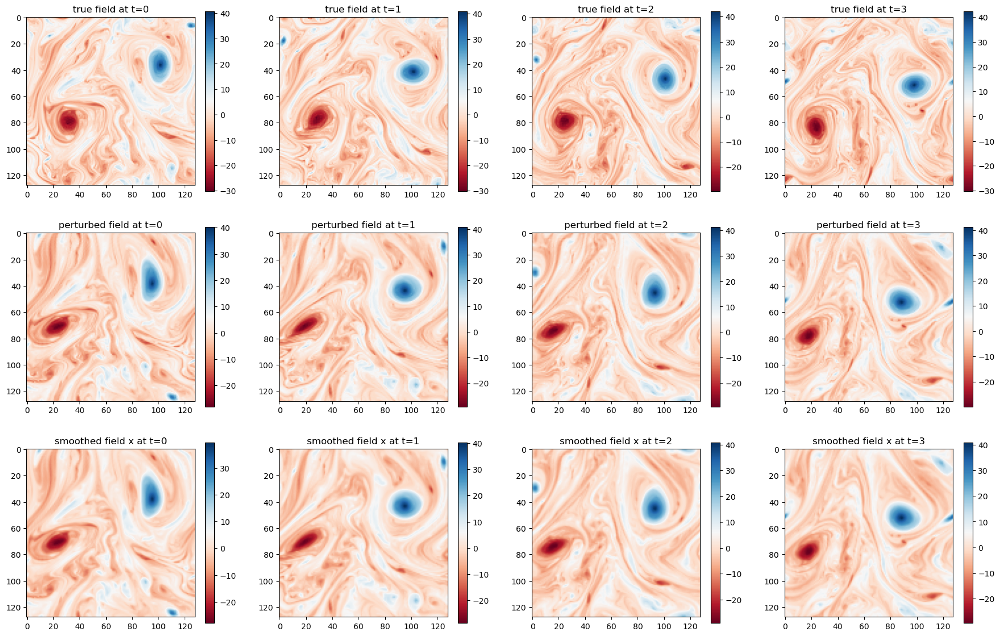

## Position-Based Uncertainty:

These perturbations mimic spatial errors arising in observations or models, where structures (e.g., eddies, vortices) are misplaced or shifted.
Position errors are particularly critical in ocean dynamics, where the spatial coherence of features affects the analysis and forecasting.

Temporal Coherence:
Errors are often not independent in time. Maintaining time correlations ensures realistic simulation of evolving structures in the field.

Controlled Randomness:
By specifying parameters such as correlation length scales, the randomness in the perturbations can be controlled, balancing spatial smoothness and variability.

The new field- so called the perturbed field is obtain by:

$$
\hat u\left( x, t \right)= u \left(x + s_i (t, x), t\right)
$$

where:

* $u \left(x,t\right)$: Original field
* $s_i(t,x)$: Displacement field (random but spatially and temporally correlated).
* x : Spatial coordinate (a vector).
* t: Time

Here is an example of perturbed field for vorticity 

To do this, 

* We choose correlation length scale. 
* we generate two random fields, one for random shift in $x$-direction and another for shift in $y$.
* The displacement field added to the old grid points to get new grid 
* We then perform normalization of the whole field to $[-1,1]$.
* We take care of the periodicity of the field.
* We then perform interpolation to get back the field on the new grid.

The correlation length scale determines the spatial smoothness of the displacement fields. Longer scales produce smoother perturbations, while shorter scales introduce finer randomness. Spatial correlations based on the chosen correlation length scale.
Temporal correlations to ensure smooth evolution over time.
Displacement Application:

* The generated displacement fields are added to the spatial coordinates of the original 
* New grid $=$ Old grid $+$ Displacement field.

Periodic boundary conditions are applied to the displacements to ensure the field wraps correctly at the edges. This avoids artifacts at the boundaries.
Interpolation:

The perturbed field is re-interpolated onto the original grid using bilinear or higher-order interpolation methods. This step ensures the perturbed field remains in a form compatible with the original resolution.

